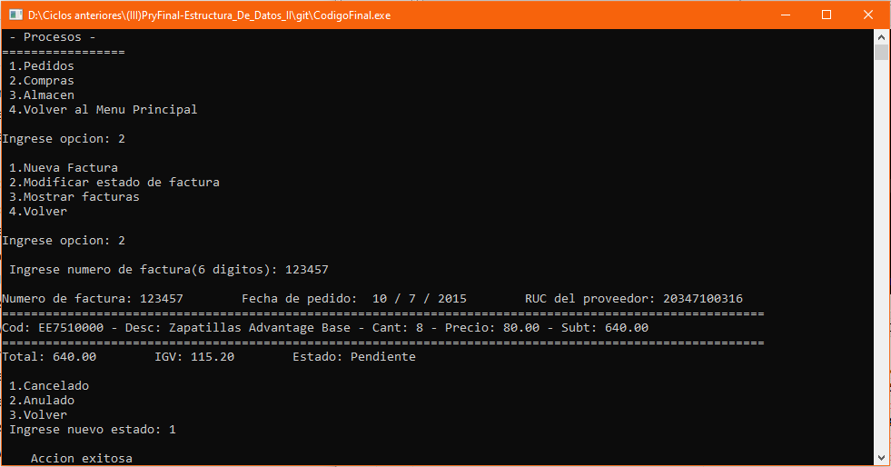
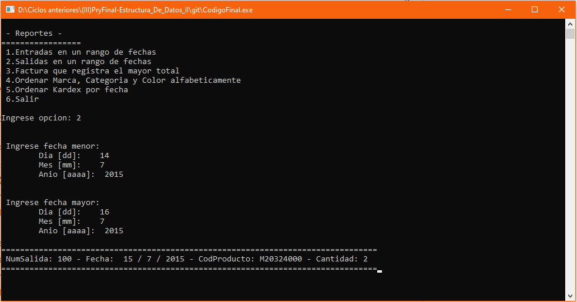

# Sistema PIMP - C++
Sistema de una empresa de calzado PIMP en lenguaje C++.  Proyecto final del **tercer semestre** de estudios de Ingeniería Informática, presentado el **13/12/18**.
## Descripción
Se hace el registro de todo producto que es comercializado en la tienda con sus características respectivas (código de referencia de almacén, marca, nombre, género, stock, categoría, talla, color y precio) así como también del proveedor que lo hace llegar (considerando para este su razón social, RUC, teléfono y dirección). Se ingresan los datos de los empleados (se considera DNI, nombre completo, edad, teléfono y fecha de contrato). Se realiza una comprobación de stocks para revisar qué productos deben pedirse urgentemente. Se realiza la compra de mercadería a los proveedores y cada producto registrado en la compra se almacena en una estructura adicional llamada detalle. Se realizan las entradas y salidas de mercadería y el detalle de las mismas es almacenado en una lista kardex.

<strong>Imagen:</strong> Menú principal.

## Uso
1. **Mantenimiento**: Lista la **Marca**, **Categoría**, **Color**, **Producto**, **Proveedor** y **Trabajador**, en cada una de estas opciones puedes realizar los siguientes procesos:  Insertar, Dar de baja, Modificar, Listar y Salir, esta última te regresa al menú de mantenimiento; también lista una opción de Volver al menú principal.

<strong>Imagen:</strong> Insertar.

<strong>Imagen:</strong> Dar de baja.

<strong>Imagen:</strong> Modificar.

<strong>Imagen:</strong> Listar.

2. **Procesos**
	- **Pedidos**: Listado de los productos registrados, indicando que producto es necesario abastecer.
	

	
	
<strong>Imagen:</strong> Pedidos.

	

	
	- **Compras**
		- **Nueva Factura**: Registrar una compra de productos a un proveedor.
		

		
		
<strong>Imagen:</strong> Opción nueva factura.

		

		
		- **Modificar estado de factura**: Modifica el estado a Pendiente (aún no ha sido pagada), Cancelado (ya fue pagada) y Anulado (ya no se requiere el producto).
		

		
		
<strong>Imagen:</strong> Opción modificar estado de factura.

		

		
		- **Mostrar facturas**: Muestra el detalle de todas las facturas registradas.
		

		
		
<strong>Imagen:</strong> Opción mostrar facturas.

		

		
		- **Volver**: Regresa al menú de Compras.
	- **Almacén**
		- **Nueva entrada**: Registra una entrada de productos según se haya comprado y generado una factura.
		

		
		
<strong>Imagen:</strong> Opción nueva entrada.

		

		
		- **Nueva salida**: Registra una salida de productos.
		

		
		
<strong>Imagen:</strong> Opción nueva salida.

		

		
		- **Mostrar Kardex**: Lista las fechas de entrada y salida de productos.
		

		
		
<strong>Imagen:</strong> Opción mostrar kardex.

		

		
		- **Volver**: Regresa al menú de Almacén.
	- **Volver al menú principal**: Regresa al menú principal.
3. **Reportes**: 
	- **Entradas en un rango de fechas**: Lista las entradas registradas entre una fecha y otra.
	

	
	
<strong>Imagen:</strong> Reporte uno.

	

	
	- **Salidas en un rango de fechas**: Lista las salidas registradas entre una fecha y otra.
	

	
	
<strong>Imagen:</strong> Reporte dos.

	

	
	- **Factura que registra el mayor total**: Muestra la(s) factura(s) que tengan el monto mayor.
	

	
	
<strong>Imagen:</strong> Reporte tres.

	

	
	- **Ordenar Marca, Categoría y Color**: Lista las Marcas, Categoría y Color ordenadas ascendentemente según su descripción.
	

	
	
<strong>Imagen:</strong> Reporte cuatro.

	

	
	- **Ordenar kardex por fecha**: Lista el Kardex ordenándolo según su fecha.
	

	
	
<strong>Imagen:</strong> Reporte cinco.

	

	
	- **Salir**: Sale del menú de reportes, retornando al menú principal.
4. **Acerca de**: Muestra una descripción del sistema y los autores de este.
5. **Salir**: Finaliza y cierra el sistema.

### Nota
- Para insertar un producto primero debes insertar por lo menos una Marca, una Categoría y un Color.
- Al insertar un producto, la talla esta entre 35 y 47, el precio entre 60 y 1600, el stock mínimo entre 1 y MAXSTOCK (1000000).
- Al insertar un trabajador, la edad esta entre 18 y 64, su fecha de contrato entre los años 1900 y 2020.
- Para realizar una comprar (**Nueva factura**), es necesario registrar un proveedor y un producto previamente.
## Autores
- Chira C. Kevin
- Garcia L. Alejandra
- Ramirez B. Rafael
- [Rojas V. Aarón](https://github.com/Aaron-Shrike)
- Torres M. Carlos

